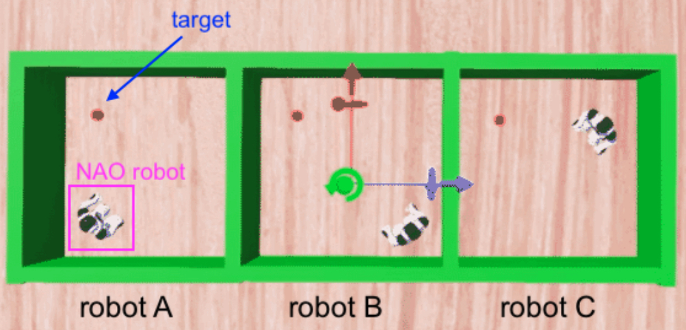

# FL-RL-NAO

This is the webot environment for our Fedros federated and reinforcement learning framework. The main control code is under controllers/my_controller.

## Environment

The project utilizes a standard webot paradigm for its framework. In addition to the FL/RL controller, we have included a foundational environment where three robots train in independent areas. See the following figure:

  

Place the folder under webot's directory and run the world(environment file under /worlds). 

## Work flow

Please check the detail in our paper [FedRos - Federated Reinforcement Learning
for Networked Mobile-Robot Collaboration](https://www.researchgate.net/profile/Wenli-Xiao-6/publication/371935017_Poster_FedRos_-Federated_Reinforcement_Learning_for_Networked_Mobile-Robot_Collaboration/links/649c32f68de7ed28ba615e8a/Poster-FedRos-Federated-Reinforcement-Learning-for-Networked-Mobile-Robot-Collaboration.pdf)

